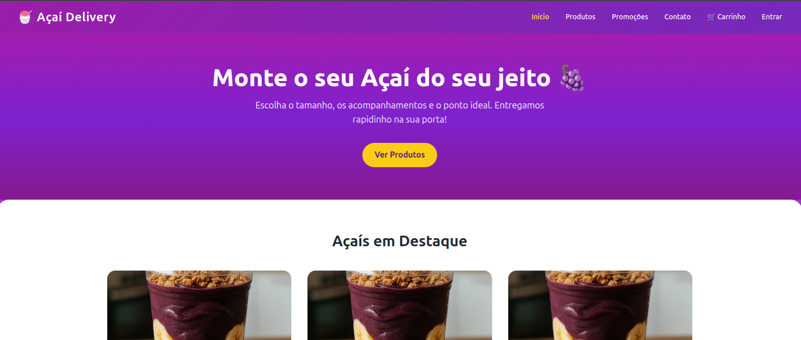
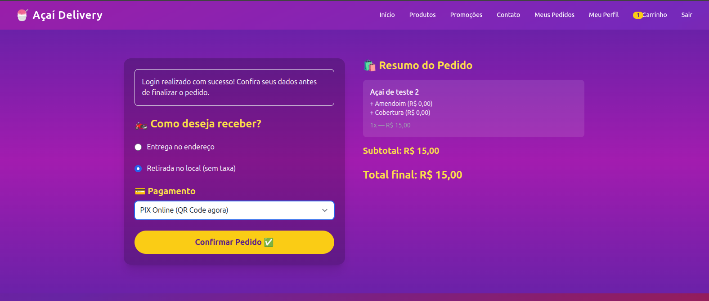
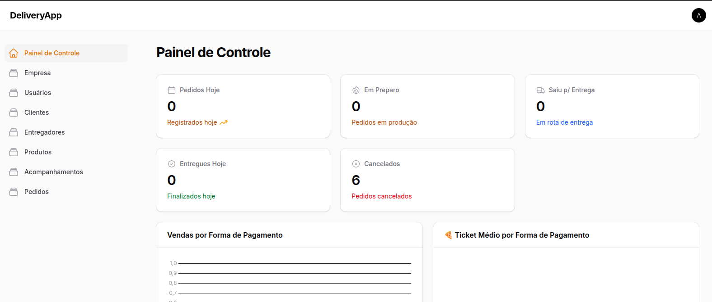

# 🛵 Delivery App — Plataforma Completa de E-commerce para Delivery

O **Delivery App** é uma aplicação web completa de delivery, desenvolvida para gerenciamento de pedidos online, cálculo de entrega e operação de vendas com pagamento integrado.

O sistema combina um site público para clientes com um painel administrativo robusto para gestão de produtos, pedidos e operação logística.

---

## 🎯 Objetivo

Criar uma plataforma capaz de:

* vender produtos online (delivery)
* gerenciar pedidos em tempo real
* calcular automaticamente taxas de entrega
* integrar pagamentos (PIX)
* oferecer controle completo da operação

---

## ⚙️ Principais funcionalidades

### 🌐 Frontend (Site público)

* catálogo de produtos com categorias
* produtos com variações e extras
* carrinho de compras em sessão
* fluxo de checkout com autenticação
* cálculo de taxa de entrega por distância
* acompanhamento de pedido em tempo real
* página de promoções
* formulário de contato

---

### 🛒 Carrinho e checkout

* adição de produtos com extras
* cálculo de subtotal e total
* escolha de entrega ou retirada
* cálculo automático de taxa via distância
* múltiplos métodos de pagamento:

  * PIX online
  * dinheiro
  * cartão
* geração de QR Code para PIX

---

### 📦 Gestão de pedidos

* criação automática de pedidos
* status do pedido:

  * pendente
  * em preparo
  * saiu para entrega
  * entregue
  * cancelado
* cancelamento com reversão de status
* impressão de pedidos (PDF e térmica)

---

### 📍 Logística e entrega

* cálculo de distância via Google Maps API
* regras configuráveis:

  * distância mínima
  * distância máxima
  * valor por km
* bloqueio automático de pedidos fora da área

---

### 🛠️ Backend (Filament Admin)

* gestão de produtos e categorias
* controle de extras/acompanhamentos
* gestão de clientes
* gestão de entregadores
* painel de pedidos com ações operacionais
* configuração da empresa (taxas e endereço)

---

### 📊 Dashboard administrativo

* pedidos do dia
* pedidos por status
* faturamento diário e mensal
* ticket médio por forma de pagamento
* distribuição de pedidos

---

## 🧠 Diferenciais técnicos

* 📍 **Cálculo de entrega via Google Distance Matrix**
* 💰 **Integração com Mercado Pago (PIX)**
* 🧩 **Sistema completo de extras por produto**
* 🔄 **Fluxo de pedido com múltiplos estados**
* 📊 **Dashboard com métricas reais**
* 🖨️ **Impressão de pedidos (PDF e térmica)**
* 🔐 **Controle de acesso com Spatie Roles**

---

## 🏗️ Arquitetura

* **Backend:** Laravel
* **Admin:** FilamentPHP
* **Frontend:** Blade + Tailwind + Vite
* **Banco:** MySQL
* **Pagamentos:** Mercado Pago
* **Integrações:** Google Maps API

📄 Detalhes técnicos: [Arquitetura do sistema](./docs/arquitetura.md)

---

## 🔄 Fluxo do sistema

1. Cliente acessa o site
2. Navega pelos produtos
3. Adiciona itens ao carrinho
4. Realiza login/cadastro
5. Escolhe entrega ou retirada
6. Sistema calcula taxa de entrega
7. Cliente escolhe forma de pagamento
8. Pedido é criado
9. Cliente acompanha status em tempo real
10. Admin gerencia o pedido no painel

---

## 📸 Demonstração

<h3 align="center">Página Inicial</h3>

  

<h3 align="center">Carrinho e Checkout</h3>

  

<h3 align="center">Painel Administrativo</h3>

  

---

## 🔗 Acesso

👉 https://delivery.jeancarlos.com.br

---

## 🚧 Status

Projeto funcional com integração real de pagamento e logística.

---

## 👨‍💻 Autor

Jean Carlos Charão Sabino
🔗 https://jeancarlos.com.br
🔗 https://www.linkedin.com/in/jeancarloscharaosabino/
